# 靶场测试环境
本地mysql开启   3306端口
user：root
pass：root
执行如下sql：
```SQL
create database shoot;
USE `shoot`;
CREATE TABLE IF NOT EXISTS `users`(
   `id` INT UNSIGNED AUTO_INCREMENT,
   `username` VARCHAR(255) NOT NULL,
   `password` VARCHAR(255) NOT NULL,
   PRIMARY KEY (`id`)
)ENGINE=InnoDB DEFAULT CHARSET=utf8;
INSERT INTO `users` VALUES (1, 'admin', 'admin123');
INSERT INTO `users` VALUES (2, 'joychou', 'joychou123');
```

# 使用的实战环境
实战给大家带的是华夏erp的项目：https://github.com/jishenghua/jshERP
需要进行简单的配置mysql和redis
配置起来想对比较简单，大家可以自行clone然后打包，或者不进行黑盒衔接，只是白盒审计的话可以直接使用我给大家打包好的jar包

# Issus

希望大家能够提出宝贵的建议，如果程序出现一些问题能够尽早的反馈给我，我会在两到三天时间进行修复和解答，感谢大家的支持。

视频观看地址：https://www.bilibili.com/video/BV19m4y1Q75X/

# 更新历史

2022.1.3:增加获取方法参数个数，可以有效对接口所有参数进行测试

2022.1.4:修复溢出等多个已知问题

2022.1.5:修复追踪递归问题，修复反编译中if中最后while循环导致if转为while的问题

2022.1.5:增加xml文件操作类库

2022.1.6:优化追踪算法，实现完全流式追踪算法

2022.1.10:优化部分代码，对于函数部分显示正常，更加精准的展示函数分类，更新了cheetah脚本代码

2022.1.11:增加插桩IAST，通过javaagent获取真正函数流，修复对于while(true)无法反编译的bug

2022.1.13:修复switch包在while底部的错误，以及switch未排序问题

2022.1.15:增加配置选项，优化皮肤

2022.1.21:修复mac下文件读取错误，增加readme

2022.9.15:修复无package错误

# wJa

wJa是一款结合DAST、SAST、IAST的综合性应用程序安全分析工具，支持对java web程序的安全性进行分析，含有反编译，代码审计，调试jar包，代理追踪等用于分析软件安全的功能。

## wJa的工作原理

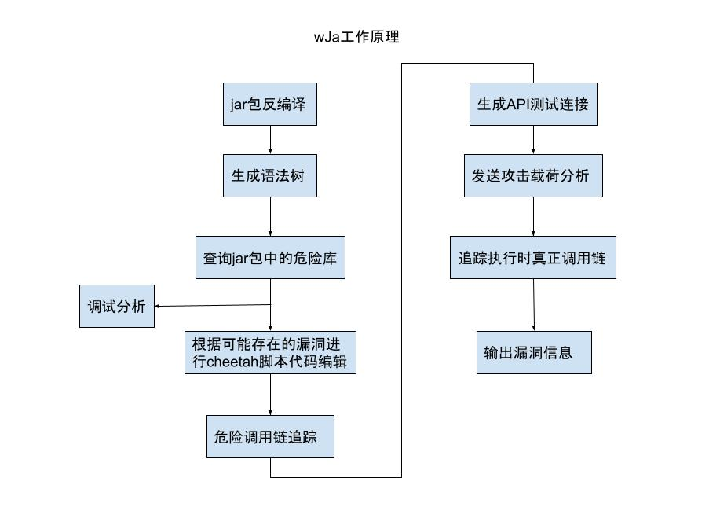

本片文章将会用几个示例来讲解如何使用wJa进行软件安全性分析

## cheetah脚本语言

为了能够让SAST更加的附有灵活性，wJa引入了cheetah脚本语言来应对复杂的代码场景，cheetah是一门基于java开发的专门针对渗透测试的脚本解析语言，如果想要完全掌握wJa的使用，灵活地进行代码审计，可以通过https://github.com/Wker666/Demo进行cheetah脚本语言的学习。

## wJa使用

需求环境：JDK 1.8

通过使用`java -jar wJa.jar`启动wJa，启动之后会要求选择指定分析的jar包程序，这里我们选择wJa自带的测试靶场进行分析。

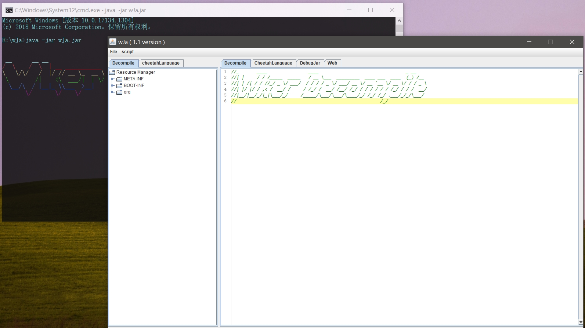

### wJa UI介绍

**菜单栏目**

File:保存当前的cheetah脚本

script:运行/停止当前cheetah脚本

**左边栏目**

Decompile:反编译文件结构

cheetahLangue:cheetah自带的支持库函数信息和当前工作区的cheetah脚本

**中间栏目**

Decompile:jar包中通过class反编译的java代码

CheetahLangue:cheetah脚本代码

DebugJar:jar文件调试

Web:简易浏览器

### wJa反编译的代码比较

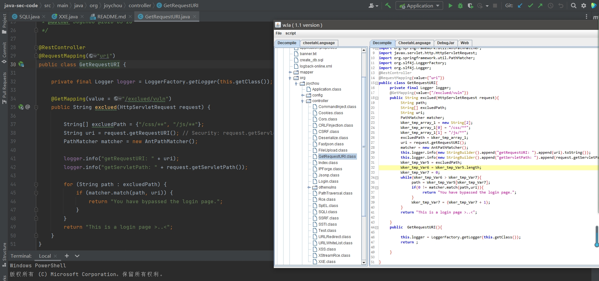

可以看到虽然与源代码不是完全相同，但是在语义上时没有区别的，反编译的代码一般来讲是不能直接运行的，但是作为分析是完全足够的。

### wJa调试jar包

在选择wJa的启动之后，wJa将会自动启动jar包，并且注入agent和attach到jar包进程上，所以wJa提供了追踪真实调用链和调试jar包的功能。

转到DebugJar栏目，可以看到如下内容：

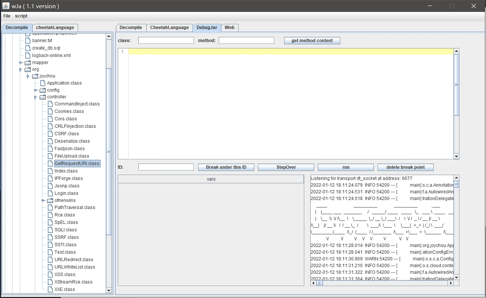

右下方是jar包的输出信息，可以看到jar包的操作信息

例如想要调试`org.joychou.controller.SQLI`中的`jdbc_sqli_vul`方法，就需要将`org/joychou/controller/SQLI`和`jdbc_sqli_vul`填入class和method中，点击get method content按钮，下方就会显示对应的代码信息：

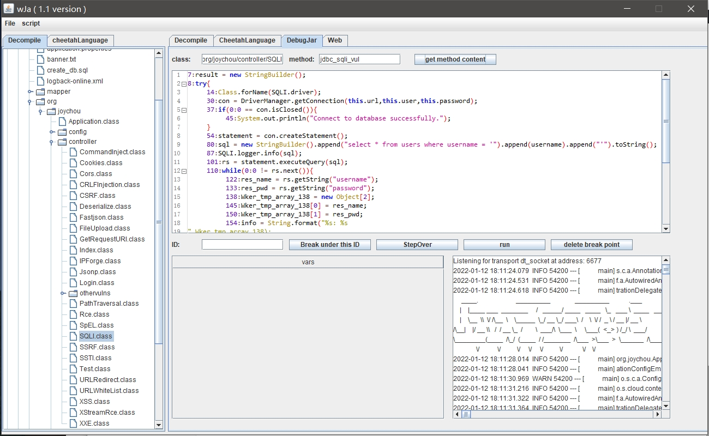

在每一条代码前方都有一个编号，这一个编号实际上对应的是这条语句执行完时的字节码偏移，可以通过这个来给代码下断，例如我想要停在`sql = new StringBuilder().append("select * from users where username = '").append(username).append("'").toString();`这条语句（并没有开始执行），那么就需要在ID中输入54，因为运行完54时候就要开始执行这条语句了，这时候我们通过浏览器访问对应的接口页面。

这里需要注意需要开启mysql，SQL注入部分需要数据库支持，建表的sql语句在create_db.sql中。

这时候可以看到调试信息：

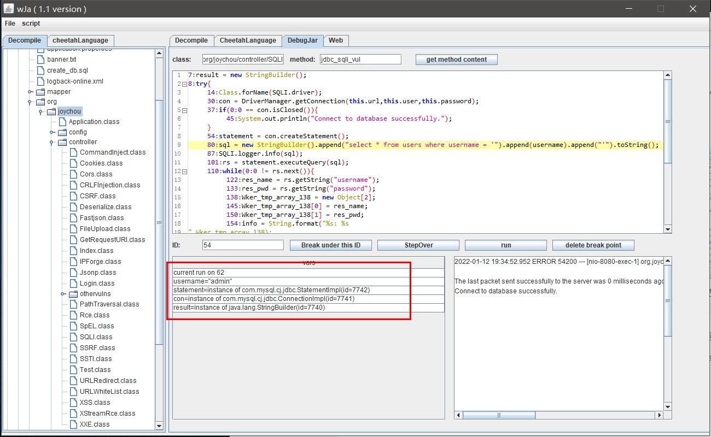

第一行信息是当前运行到的字节码偏移，下面就是变量信息，下面就可以单步步过一步步调试。

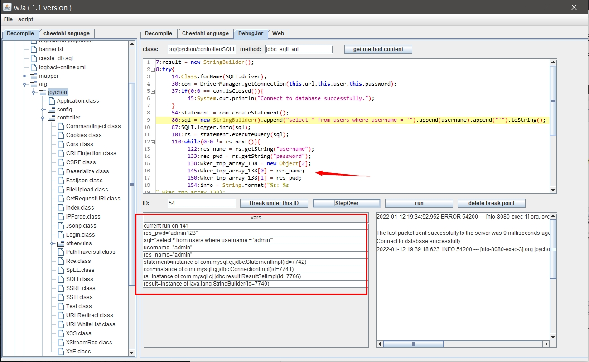

### Agent方法的IAST跟踪

通过调用：`StartRecordFun`和`StopRecordFun`方法进行起始和结束的跟踪。

```
StartRecordFun
无参数
返回值:无
StopRecordFun
参数1:要查询的起始类名+方法名
返回值:执行流数组
```

需要注意的是不能注入所有的类，因为SpringBoot启动类不能注入，注入的话运行速度太慢了，所以需要在`config/agent_exclude.txt`指定不注入的类起始字符，例如：org/springframework

## 案例1：扫描SQL注入

根据三元组原理，首先需要找到入口点，而入口点则是类的方法，可是并不是所有类都是SpringBoot的类，这时候就需要扫描存在指定注解的类，wJa自带了扫描的方法：

```javascript
function getSpringAnnotationValue(an){
	anSize = GetArrayNum(an);
	i = 0;
	flag = 0;
	while(i < anSize){
		if(GetAnnotationName(an[i]) == "org/springframework/web/bind/annotation/RequestMapping"){
			allValue = GetAnnotationArgListValue(an[i],"value");
			return allValue[0];
		}
		if(GetAnnotationName(an[i]) == "org/springframework/web/bind/annotation/GetMapping"){
			allValue = GetAnnotationArgListValue(an[i],"value");
			return allValue[0];
		}
		if(GetAnnotationName(an[i]) == "org/springframework/web/bind/annotation/PostMapping"){
			allValue = GetAnnotationArgListValue(an[i],"value");
			return allValue[0];
		}
		if(GetAnnotationName(an[i]) == "org/springframework/web/bind/annotation/RequestParam"){
			allValue = GetAnnotationArgSingValue(an[i],"value");
			return allValue;
		}
		if(GetAnnotationName(an[i]) == "org/springframework/web/bind/annotation/RestController"){
			flag = 1;
		}
		i = ToInt(i + 1);
	}
	if(flag == 1){
		return "/";
	}
	return "";
}

function GetAllSpringApiClasses(){
	array res;
	allClass = GetAllClassName();
	size = GetArrayNum(allClass);
	i = 0;
	while(i < size){
		an = GetClassAnnotation(allClass[i]);
		p = getSpringAnnotationValue(an);
		if(p != ""){
			ArrayAddEle(res,allClass[i]);
		}
		i = ToInt(i + 1);
	}
	return res;
}
```

具体代码是通过支持库函数得到所有的类，对所有的类判断注解是否存在Spring接口，如果存在则添加，最终以数组的方式返回所有满足接口要求的类。

有了类之后就需要遍历所有的方法。

```javascript
function SQLTrack(className){
	an = GetClassAnnotation(className);
	classPath = baseUrl.getSpringAnnotationValue(an);
	methods = GetAllMethodName(className);
	size = GetArrayNum(methods);
	i = 0;
	while(i < size){
		argCnt = GetMethodArgCnt(className,methods[i]);
		j = 0;
		while(j < argCnt){
			if(methods[i] != "<init>"){trackSQL(className,methods[i],classPath,j);}
			j = ToInt(j+1);
		}
		i = ToInt(i+1);
	}
	return 0;
}
```

`SQLTrack`方法通过传入className来进行SQL注入的追踪，遍历所有的类方法调用`trackSQL`函数进行判断是否存在漏洞。

```javascript
function trackSQL(className,methodName,url,argIndex){
	array allNode;
	allNode = TrackVarIntoFun(className,methodName,argIndex,"java/sql/Statement","executeQuery",0,1);
	size = GetArrayNum(allNode);
	if(ToInt(size-1) < 0){return 0;}
	i = 0;
	print(methodName.":SQL注入 白盒测试调用链跟踪:");
	cc = 7;
	cs = 1;
	while(i < size){
		sentence = GetJavaSentence(allNode[i]);
		noSan = filter(sentence,GetTrackName(allNode[i]));
		if(noSan == 0){cc = 5;cs = 5;}
		if(i == ToInt((size-1))){
			if(cc != 5){cs = 2;cc = 3;}
		}else{}
		if(noSan == 0){
			printcolor("[-]",6);printcolor("想办法绕过此类：",4);
		}else{
			printcolor("[+]",1);
		}
		printcolor(GetClassName(GetNodeClassName(allNode[i]))."   ",cc);
		printcolor(sentence.StrRN(),cs);
		i = ToInt(i+1);
	}
	if(cc != 5){
		printcolor("白盒测试发现此调用链可能存在漏洞，生成测试链接进行黑盒测试".StrRN(),7);
		an = GetClassMethodAnnotation(className,methodName);
		var argName;
		try{
			arg_an = GetClassMethodArgAnnotation(className,methodName,0);
			argName = getSpringAnnotationValue(arg_an);
		}catch(){
			argName = GetClassMethodArgName(className,methodName,0);
		}
		if(argName != ""){
			api = url.getSpringAnnotationValue(an)."?".argName."=Wker";
			StartRecordFun();
			if(judgeSQLI(api) == 1){
				printcolor("[+]生成测试链接:".api."   测试存在SQL注入漏洞!".StrRN(),3);
			}else{
				printcolor("[-]生成测试链接:".api."   测试不存在SQL注入漏洞!请自行测试。".StrRN(),5);
			}
			print("IAST真实调用链:",StopRecordFun(className.".".methodName));
		}else{
			printcolor("测试链接生成失败,error:未找到参数入口!".StrRN(),5);
		}
	}
	
	return 0;
}
```

`TrackVarIntoFun`方法是支持库函数：

```
参数1:起始类
参数2:起始方法
参数3:起始方法参数下标
参数4:目标方法的类
参数5:目标方法
参数6:目标方法的参数下标
参数7:0:一直跟踪1:只跟踪到sink
返回值:执行流node数组
```

通过传入入口点和污点聚集点来判断是否存在直连，并且返回执行流的所有节点，返回的节点是一个对象，可以通过对应的函数获取相对信息。

node节点可以获得的信息：

1. 当前node节点的类+方法
2. 当前追踪的变量
3. 执行的java代码

如果存在调用的话那么就将调用链进行打印，并且判断路径中是否存在过滤函数。

过滤函数判断使用正则即可，需要传入的是java代码和当前追踪的变量：

```javascript
#define filter1=String.valueOf(.*?
#define filter2=Integer.valueOf(.*?
#define filter3=Long.valueOf(.*?

function filter(sentence,trackName){
	ap = trackName.".*?)";
	a = StrRe(sentence,filter1.ap);
	if(GetArrayNum(a) != 0){return 0;}
	a = StrRe(sentence,filter2.ap);
	if(GetArrayNum(a) != 0){return 0;}
	a = StrRe(sentence,filter3.ap);
	if(GetArrayNum(a) != 0){return 0;}
	return 1;
}
```

后期会提供更加标准的规则。

如果不存在过滤函数则进入黑盒检测，这里通过注解拼接得到真正的测试连接，调用`judgeSQLI`方法判断此链接，通过or判断是否存在SQL注入：

```javascript
function judgeSQLI(api){
	res = HttpGet(api,cookie);
	res1 = HttpGet(api."%27%20or%201=1--+",cookie);
	if(GetStrLength(res1[0]) != GetStrLength(res[0])){
		res2 = HttpGet(api."%27%20or%202=1--+",cookie);
		if(GetStrLength(res2[0]) == GetStrLength(res[0])){
			return 1;
		}
	}
	return 0;
}
```

最终看一下打印的信息。

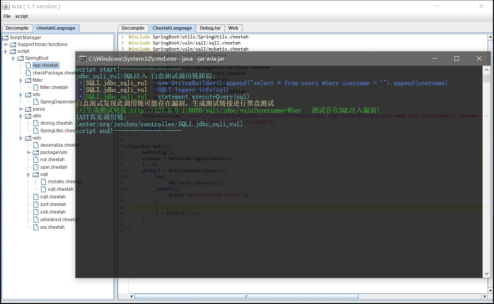

可以看到最终成功打印出存在SQL注入的调用链并且黑盒测试存在漏洞。

细心的朋友可能发现这里面存在一条真实IAST调用链，这个是通过java agent注入得到的真实调用，可以看到确实进入了SQLI的危险函数。

## 案例2：获取危险库

靶场已经了解的差不多了，那么就进入实战操作，这里用到的实战项目是华夏ERP：https://github.com/jishenghua/jshERP。

需要启动mysql和redis，并且进行简单的配置，这里就不赘述，可以根据项目github的readme进行操作。

同样的打开jar包。

wJa自带了一个检查危险库的方法，是通过扫描pom.xml导入的库判断是会否存在危险的库，源代码不贴了，运行结果：

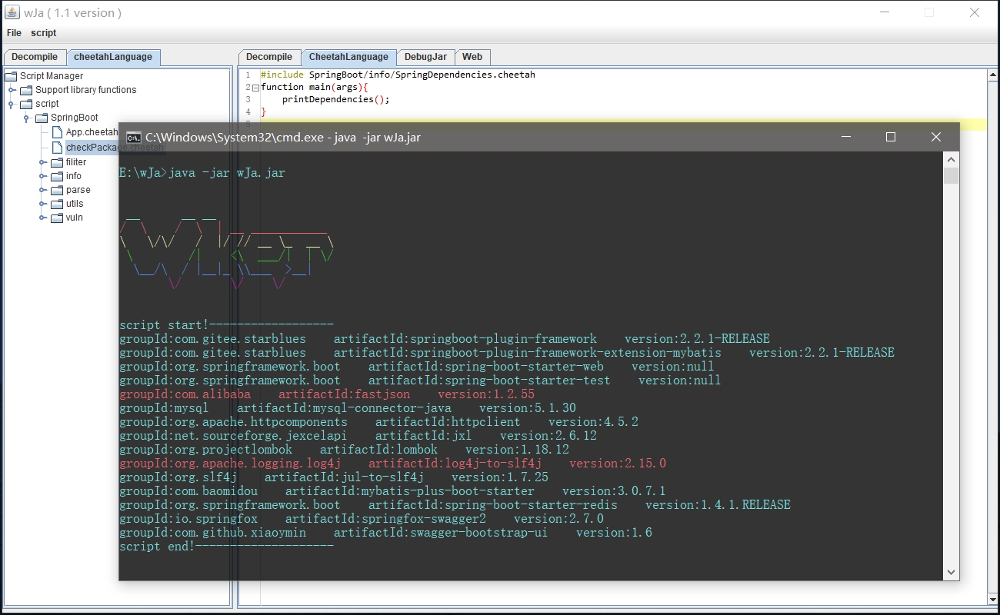

可以看到存在危险的fastjson和log4j组件。

## 案例3：fastjson检测

与SQLI检测唯一的不同就是sink的函数是不同的，并且检测方法也是不同的。

sink函数fastjson的parseObject方法，所以应该这样子改变：`TrackVarIntoFun(className,methodName,argIndex,"com/alibaba/fastjson/JSONObject","parseObject",0,1);`

对于fastjson的检测最好借助dnslog，所以需要写一个dnslog的工具包：

```javascript
function getDnsLogDomain(){
    SetGlobalValue("dnslogCookie","User-Agent: Mozilla/5.0 (Windows NT 6.1; WOW64) AppleWebKit/537.36 (KHTML, like Gecko) Chrome/50.0.2661.87 Safari/537.36".StrRN()."Cookie: PHPSESSID=wJa;");
    res = HttpGet("http://www.dnslog.cn/getdomain.php?t=0.02695357778962082",dnslogCookie);
    dns = StrSplit(res[0],StrRN());
    return dns[0];
}
function getDnsLogRecord(){
    res = HttpGet("http://www.dnslog.cn/getrecords.php?t=0.29442376629799494",dnslogCookie);
    rec = StrSplit(res[0],StrRN());
    return rec[0];
}
```

通过获得dns域名，然后通过`java.net.Inet4Address`访问对应的dns查看回显判断是否真实存在反序列化漏洞。

```javascript
function judgeFastjson(api){
	domain = getDnsLogDomain();
	res1 = HttpGet(api."%7B%22%40type%22%3A%22java.net.Inet4Address%22%2C%22val%22%3A%22".domain."%22%7D",cookie);
	Sleep(1000);
	if(getDnsLogRecord() != "[]"){
		return 1;
	}
	return 0;
}
```

最终执行脚本发现存在对应的调用链：

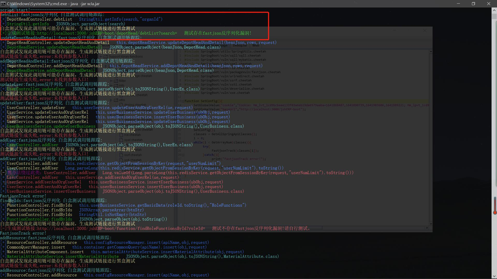

发现有一条完整并且黑盒测试正常的调用链，下面也有测试不存在的，并且也检查到了存在过滤函数的。

通过这样子的测试可以挖取到所有的调用链，存在过滤函数或者测试失败的可以debug分析一下看看是否存在bypass的方法。

## 案例4：mybatis类型的SQLI

与普通的SQLI注入不同，这一个sink函数并不是固定的，而是通过xml文件进行动态设置的，这里也能体现出wJa的灵活性，可以灵活的应对不同的复杂场景。

### 获取所有映射的xml文件名称

```javascript
function GetConfigeFileMap(path){
    ap = GetFileContent(path);
    allPro = StrSplit(ap,StrRN());
    i = 0;
    size = GetArrayNum(allPro);
    res = GetHashMap();
    while(i < size){
        cur = allPro[i];
        index = StrFindStr(cur,"=",0);
        if(index == "-1"){
        	i = ToInt(i+1);
        	continue;
        }
        key = StrSubString(cur,0,index);
        value = StrSubString(cur,ToInt(index+1),GetStrLength(cur));
        SetHashMapValue(res,key,value);
        i = ToInt(i+1);
    }
    return res;
}
function GetApplicationPro(){
	return GetConfigeFileMap("BOOT-INF/classes/application.properties");
}
function getAllMapperXmlFileNames(){
	pro = GetApplicationPro();
	v = GetHashMapValue(pro,"mybatis-plus.mapper-locations");
	index = StrFindStr(v,":",0);
	path = StrSubString(v,ToInt(index+1),GetStrLength(v));
	return MatchesFileName(GetFilePath(path));
}
```

通过`application.properties`中的`mybatis-plus.mapper-locations`属性得到文件夹，再通过`MatchesFileName`支持库函数得到所有的xml文件。

### 解析xml文件得到SQL类和方法

得到xml文件之后进行解析

```javascript
function getClassMethodName(root){
	array res;
	childs = GetElementChilds(root);
	childSize = GetArrayNum(childs);
	i = 0;
	while(i < childSize){
		if(GetElementName(childs[i]) == "select"){
			attributes = GetElementAttributes(childs[i]);
			attributeSize = GetArrayNum(attributes);
			j = 0;
			while(j < attributeSize){
				if(GetAttributeName(attributes[j]) == "id"){
					ArrayAddEle(res,GetAttributeText(attributes[j]));
				}
				j = ToInt(j + 1);
			}
		}
		i = ToInt(i + 1);
	}
	return res;
}
function getClassName(root){
	attributes = GetElementAttributes(root);
	attributeSize = GetArrayNum(attributes);
	j = 0;
	while(j < attributeSize){
		if(GetAttributeName(attributes[j]) == "namespace"){
			return GetAttributeText(attributes[j]);
		}
		j = ToInt(j + 1);
	}
	return "";
}
```

通过传入的xml root（这个可以通过xml类支持库函数得到），namespace属性是类名，这里只截取select的方法，获取对应的id就是对应的方法名，最终可以得到所有的类名和方法名。

获取到所有的mybatis方法之后就需要带入之前的SQLI中，需要动态设置sink：

```javascript
function MybatisSQLTrack(className){
    an = GetClassAnnotation(className);
    classPath = baseUrl.getSpringAnnotationValue(an);
    methods = GetAllMethodName(className);
    size = GetArrayNum(methods);
    mybatisXmls = getAllMapperXmlFileNames();
    xmlSize = GetArrayNum(mybatisXmls);
    xmlIndex = 0;
    while(xmlIndex < xmlSize){
        root = GetXMLRoot(GetFileContent(mybatisXmls[xmlIndex]));
        mybatisClassName = StrReplace(getClassName(root),"\.","/");
        mybatisMethodNames = getClassMethodName(root);
        mybatisMethodNameSize = GetArrayNum(mybatisMethodNames);
        mybatisMethodIndex = 0;
        while(mybatisMethodIndex < mybatisMethodNameSize){
            curMybatisMethodName = mybatisMethodNames[mybatisMethodIndex];
            //mybatis注入
            i = 0;
            while(i < size){
                argCnt = GetMethodArgCnt(className,methods[i]);
                j = 0;
                while(j < argCnt){
                    if(methods[i] != "<init>"){
                        trackMybatisSQL(className,methods[i],classPath,j,mybatisClassName,curMybatisMethodName);
                    }
                    j = ToInt(j+1);
                }
                i = ToInt(i+1);
            }
            mybatisMethodIndex = ToInt(mybatisMethodIndex + 1);
        }
        xmlIndex = ToInt(xmlIndex + 1);
    }
	return 0;
}
```

逻辑相对也是比较简单的，与之前不同的是需要动态传入sink类和方法，执行查看结果：

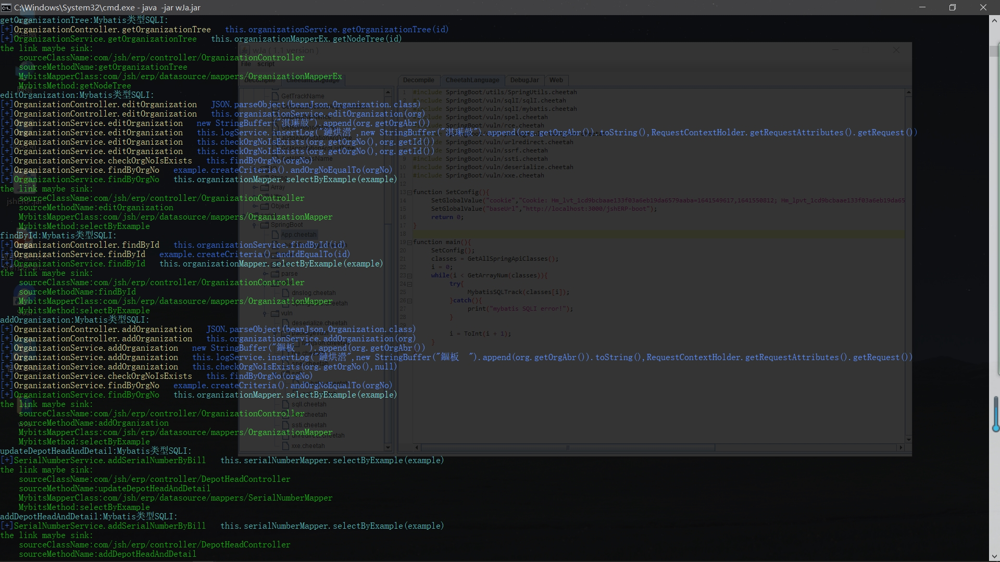

最终可以打印出所有调用链。

## 目前自带的漏洞检测脚本

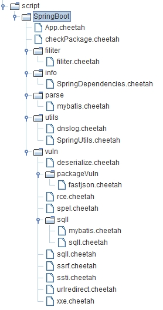

虽然写了不少，但是还是需要根据所应对的场景自己进行修改。

## wJa的一些细节

wJa实现了流式算法，可以追踪包括map在内的变量跳转，并且会根据java的实现类和子类进行跳转扫描，保证所有调用链的完全扫描。

## wJa Link

https://github.com/Wker666/wJa

如果存在错误或者bug，请在issue中提出，Wker将在两天内修复！

hxd写了这么多，给个Star吧Thanks♪(･ω･)ﾉ